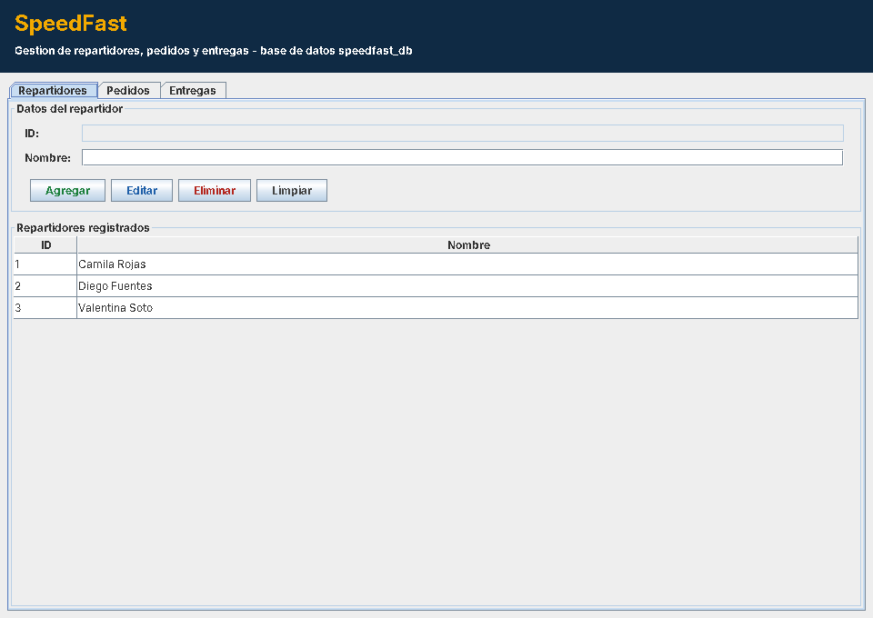
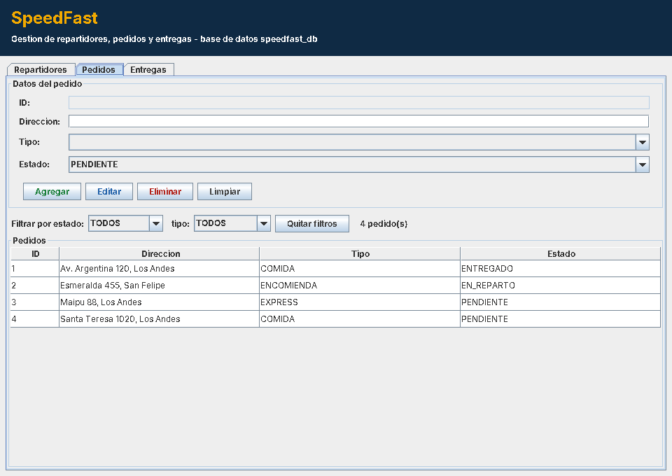
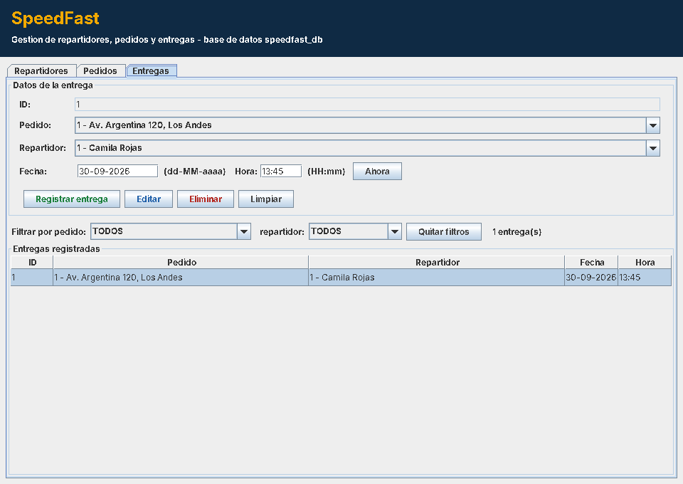
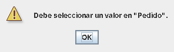

# SpeedFast - Persistiendo datos con objetos y base de datos (Semana 8)

Actividad sumativa 3 de Desarrollo Orientado a Objetos II (PRY2203).

Aplicacion de escritorio en Java Swing que gestiona **repartidores**, **pedidos** y **entregas** de SpeedFast
con operaciones CRUD persistentes en MySQL. El acceso a datos se separa en clases DAO que usan
`PreparedStatement` y `ResultSet`, la interfaz valida cada dato antes de enviarlo y los errores de base de
datos se muestran al usuario con mensajes claros en `JOptionPane`.

## Requisitos

- IntelliJ IDEA con JDK 17 o superior.
- MySQL 8 (o compatible) en `localhost:3306`.
- Maven (incluido en IntelliJ). El driver `mysql-connector-j` se descarga desde el `pom.xml`.

## Como ejecutar

1. Ejecutar el script `sql/speedfast_db.sql` en MySQL Workbench (o `mysql -u root -p < sql/speedfast_db.sql`).
   Crea la base `speedfast_db`, las tablas `repartidores`, `pedidos` y `entregas` y algunos datos de ejemplo.
2. Revisar usuario y clave en `src/main/resources/db.properties`.
3. Abrir la carpeta del proyecto en IntelliJ (se reconoce como proyecto Maven por el `pom.xml`).
4. Ejecutar la clase `Main`. Si la conexion falla, la aplicacion explica que revisar y se cierra.

## Estructura

```
Nicolas_Ahumada_SpeedFast_S8/
├── pom.xml
├── sql/
│   └── speedfast_db.sql              Script de la base de datos y datos de ejemplo
├── docs/                             Capturas de la aplicacion
└── src/main/
    ├── resources/
    │   └── db.properties             URL, usuario y clave de MySQL
    └── java/
        ├── Main.java                 Prueba la conexion y abre la ventana principal
        ├── modelo/
        │   ├── Repartidor.java
        │   ├── Pedido.java
        │   ├── Entrega.java
        │   ├── TipoPedido.java       COMIDA | ENCOMIENDA | EXPRESS
        │   └── EstadoPedido.java     PENDIENTE | EN_REPARTO | ENTREGADO
        ├── dao/
        │   ├── CrudDAO.java          Interfaz generica: create, readAll, update, delete
        │   ├── DAOException.java     Traduce SQLException a mensajes para el usuario
        │   ├── RepartidorDAO.java
        │   ├── PedidoDAO.java        + filtros por estado y tipo, cambio de estado
        │   └── EntregaDAO.java       + JOIN con pedido y repartidor, filtros
        ├── controlador/
        │   ├── ControladorRepartidores.java
        │   ├── ControladorPedidos.java
        │   └── ControladorEntregas.java
        ├── util/
        │   ├── ConexionDB.java       Conexion JDBC configurable
        │   ├── Validador.java        Validaciones reutilizables de los formularios
        │   └── ValidacionException.java
        └── vista/
            ├── VentanaPrincipal.java JFrame con pestanas
            ├── PanelBase.java        Comportamiento comun de los formularios
            ├── PanelRepartidores.java
            ├── PanelPedidos.java
            ├── PanelEntregas.java
            └── Colores.java
```

## Arquitectura por capas

```
 Vista (Swing)            Controlador              DAO (JDBC)                MySQL
 ┌──────────────┐  datos  ┌──────────────┐  objeto  ┌──────────────────┐  SQL  ┌──────────────┐
 │ PanelPedidos │ ──────> │ Controlador  │ ───────> │ PedidoDAO        │ ────> │ pedidos      │
 │  valida con  │ validos │ Pedidos      │          │ PreparedStatement│       │ repartidores │
 │  Validador   │ <────── │              │ <─────── │ ResultSet        │ <──── │ entregas     │
 └──────────────┘ mensaje └──────────────┘ lista /  └──────────────────┘       └──────────────┘
                  o error                  DAOException
```

1. El usuario presiona un boton (Agregar, Editar, Eliminar).
2. La vista valida los campos con `Validador` y, si algo falla, muestra el motivo sin tocar la base de datos.
3. Con los datos validos arma el objeto del modelo y llama al controlador.
4. El controlador delega en el DAO, que ejecuta la sentencia parametrizada y cierra la conexion con try-with-resources.
5. Si MySQL rechaza la operacion, el DAO lanza `DAOException` con un mensaje comprensible y la vista lo muestra.
6. Tras cada cambio, la ventana principal refresca todas las tablas y los `JComboBox`.

## Requerimientos implementados

| Requerimiento | Implementacion |
|---|---|
| Gestion de repartidores | Registrar (nombre), editar, eliminar y listar en `JTable` |
| Gestion de pedidos | Registrar (direccion, tipo, estado), editar, eliminar, listar con filtros opcionales por estado y tipo |
| Gestion de entregas | Registrar asociando pedido y repartidor con fecha y hora; editar, eliminar; listar por pedido o por repartidor |
| Interfaz Swing | `JFrame`, `JPanel`, `JTable`, `JTextField`, `JComboBox`, `JButton`, `JOptionPane`, `JTabbedPane` |
| Combos relacionados | Muestran `id - direccion` y `id - nombre`, pero guardan el objeto completo (el id se conserva). Se recargan al crear, editar o eliminar |
| Persistencia JDBC | `ConexionDB`, `PreparedStatement`, `ResultSet`, ids generados con `RETURN_GENERATED_KEYS` |
| DAO por entidad | `RepartidorDAO`, `PedidoDAO` y `EntregaDAO` implementan `CrudDAO<T>` con `create()`, `readAll()`, `update()`, `delete()` |

## Validaciones de entrada

| Campo | Regla |
|---|---|
| Nombre del repartidor | Obligatorio, 3 a 100 caracteres, solo letras, espacios, punto, apostrofo o guion |
| Direccion del pedido | Obligatoria, 5 a 100 caracteres, debe incluir letras; signos permitidos `# . , / -` |
| Tipo y estado | Seleccion obligatoria en el combo |
| Pedido y repartidor de la entrega | Seleccion obligatoria; aviso si aun no hay registros |
| Fecha | Formato `dd-MM-aaaa` estricto (rechaza 31-02-2026) |
| Hora | Formato `HH:mm` de 24 horas (rechaza 25:00) |
| Fecha y hora de entrega | No pueden ser posteriores al momento actual |

Los espacios sobrantes se eliminan antes de guardar.

## Manejo de errores

- Cada operacion del DAO captura `SQLException` y la convierte en `DAOException` segun su codigo SQLState:
  sin conexion (08), credenciales incorrectas (28), integridad referencial (23) o datos fuera de formato (22).
  El detalle tecnico queda registrado en consola.
- Eliminar un repartidor o un pedido con entregas asociadas muestra un mensaje que explica que hacer,
  en lugar del error de clave foranea.
- Editar o eliminar un registro que ya no existe (por ejemplo, borrado desde otra sesion) se informa al usuario.
- `Main` prueba la conexion al iniciar y, si falla, indica que revisar.
- Todas las conexiones, sentencias y resultados se cierran con try-with-resources.

## Funcionalidades adicionales

- Al registrar una entrega cuyo pedido no esta ENTREGADO, la aplicacion ofrece actualizar su estado.
- Boton **Ahora** para completar fecha y hora actuales.
- Las tablas se pueden ordenar haciendo clic en los encabezados y conservan la fila seleccionada al refrescar.

## Capturas

Gestion de repartidores



Gestion de pedidos con filtros



Gestion de entregas con combos cargados desde la base de datos



Validacion antes de ejecutar una operacion



## Autor

Nicolas Ahumada - Desarrollo Orientado a Objetos II, Duoc UC.
